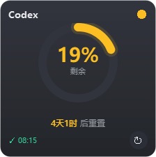

# Codex Usage Watch

> Windows 桌面悬浮窗 · 实时监视 Codex(GPT) 剩余用量与重置倒计时


每 30 分钟自动查询一次 Codex 配额，以置顶悬浮卡片常驻桌面：圆环仪表直观显示剩余百分比，
倒计时提示下次重置时间，健康配色（绿 / 琥珀 / 红）一眼识别余量状态。

<p align="center">
  
</p>

## ✨ 功能特性

- **仪表化展示** — 圆环仪表 + 健康色贯穿（剩余 <30% 转琥珀、<15% 转红），百分比数字带滚动动画
- **极简交互** — 无边框半透明卡片，任意位置拖拽，默认窗口置顶（右键可切换）
- **信息分层** — 主视图只保留核心指标，各模型配额/计划/积分等低频信息收入右键菜单
- **查询动效** — 查询期间圆环切换为旋转扫描弧，按钮同步禁用防止并发
- **定时刷新** — 30 分钟自动查询，支持按钮/菜单手动触发
- **位置记忆** — 窗口位置即时持久化，重启还原；分辨率变化自动约束回可见屏幕
- **安全认证** — 经 Codex CLI 官方 `app-server` 接口查询，完全不触碰 `auth.json`，无掉登录风险
- **静默运行** — 无控制台窗口、不进任务栏，纯悬浮常驻

## 🔍 工作原理

应用以子进程方式启动 Codex CLI 的 `codex app-server`（stdio JSON-RPC 服务），完成 `initialize`
握手后调用 `account/rateLimits/read` 获取官方配额数据：

```json
{
  "rateLimitsByLimitId": {
    "codex": {
      "primary": { "usedPercent": 81, "windowDurationMins": 10080, "resetsAt": 1789436390 },
      "planType": "prolite"
    }
  }
}
```

**为什么不直接调 ChatGPT Web API？** OpenAI 的 OAuth refresh token 是轮换制的——手动刷新后若不
精确回写会导致 Codex 掉登录。走 `app-server` 让 Codex CLI 自行管理 token 刷新，零风险。
本仓库的 `codex_usage.py` 是同一链路的命令行版本，便于脚本化调用。

## 📦 安装与使用

### 前置条件

- Windows 10/11
- [Codex CLI](https://github.com/openai/codex) 已安装并登录（`codex login`）
- Python 3.9+ 与 PyQt5

### 启动

```bash
pip install PyQt5
python main.py            # 或直接双击「启动悬浮窗.bat」(pythonw 无控制台)
```

### 开机自启

将 `启动悬浮窗.bat` 的快捷方式放入 `shell:startup` 文件夹即可。

## 🖱 交互说明

| 操作 | 效果 |
|---|---|
| 左键拖拽 | 移动窗口（位置即时保存） |
| 点击 ↻ / 右键「立即刷新」 | 手动查询最新用量 |
| 右键菜单 | 查看各配额详情 / 切换置顶 / 退出 |
| 自动 | 每 30 分钟刷新，底部显示「✓ 更新时间」 |

## 📁 项目结构

```
codexUsageWatch/
├── main.py              # 悬浮窗 UI(圆环仪表/拖拽/右键菜单/定时器)
├── quota_worker.py      # 后台查询 Worker(worker-object 模式)
├── codex_rpc.py         # app-server JSON-RPC 查询封装
├── codex_usage.py       # CLI 查询脚本(同链路, 便于脚本化调用)
├── _selftest.py         # offscreen 回归自测(不弹窗)
├── 启动悬浮窗.bat        # 无控制台启动脚本
└── screenshots/         # 界面截图
```

## ❓ 常见问题

**查询失败 / 未找到 codex.exe？**
应用按「安装目录 → PATH」顺序探测 Codex CLI。若为自定义安装路径，请将 `codex.exe`
所在目录加入 PATH，或修改 `codex_rpc.py` 中的 `CODEX_CANDIDATES`。

**每次查询耗时多久？**
实测约 3~5 秒（含子进程启动与 API 往返），全程在工作线程执行，UI 无感。

**启动时控制台提示 config.toml 告警？**
那是 Codex CLI 自身的配置告警（如无效的 `flexgpt` 变体值），与本应用无关，可按告警行号
修正 `~/.codex/config.toml`。

## 📄 License

[MIT](LICENSE)
